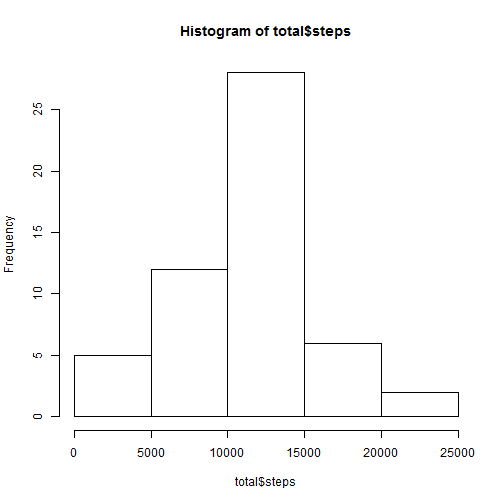

# **First assignment**

## Loading Data


```r
data <- read.csv("activity.csv")
summary(data)
```

```
##      steps                date          interval     
##  Min.   :  0.00   2012-10-01:  288   Min.   :   0.0  
##  1st Qu.:  0.00   2012-10-02:  288   1st Qu.: 588.8  
##  Median :  0.00   2012-10-03:  288   Median :1177.5  
##  Mean   : 37.38   2012-10-04:  288   Mean   :1177.5  
##  3rd Qu.: 12.00   2012-10-05:  288   3rd Qu.:1766.2  
##  Max.   :806.00   2012-10-06:  288   Max.   :2355.0  
##  NA's   :2304     (Other)   :15840
```

```r
names(data)
```

```
## [1] "steps"    "date"     "interval"
```

```r
head(data)
```

```
##   steps       date interval
## 1    NA 2012-10-01        0
## 2    NA 2012-10-01        5
## 3    NA 2012-10-01       10
## 4    NA 2012-10-01       15
## 5    NA 2012-10-01       20
## 6    NA 2012-10-01       25
```


## What is mean total number of steps taken per day?

1.Calculate the total number of steps taken per day


```r
total <- aggregate(steps~date,data,sum,na.rm=TRUE)
```

2.Make a histogram of the total number of steps taken each day


```r
hist(total$steps)
```



3.Calculate  the mean and median of the total number of steps taken per day


```r
meansteps <- mean(total$steps)
meansteps
```

```
## [1] 10766.19
```

```r
mediansteps <- median(total$steps)
mediansteps
```

```
## [1] 10765
```

## What is the average daily activity pattern?

1. Time series plot (i.e. 𝚝𝚢𝚙𝚎 = “𝚕”) of the 5-minute interval (x-axis) and the average number of steps taken, averaged across all days (y-axis)


```r
stepsbyinterval <- aggregate(steps~interval,data,mean,na.rm=TRUE)

plot(steps~interval,data=stepsbyinterval, type="l")
```


2. Which 5-minute interval, on average across all the days in the dataset, contains the maximum number of steps?


```r
intervalWithMaxSteps <- stepsbyinterval[which.max(stepsbyinterval$steps),]$interval

intervalWithMaxSteps
```

```
## [1] 835
```

## Imputing missing values

1. Calculate and report the total number of missing values in the dataset (i.e. the total number of rows with NA's)


```r
missing <- sum(is.na(data$steps))

missing
```

```
## [1] 2304
```

2. Devise a strategy for filling in all of the missing values in the dataset. The strategy does not need to be sophisticated. For example, you could use the mean/median for that day, or the mean for that 5-minute interval, etc.


fill in all the missing values in the dataset with the mean per interval. Here’s the function that will return, for a particular interval, the mean value


```r
getMeanStepsPerInterval<-function(interval){
    stepsbyinterval[stepsbyinterval$interval==interval,]$steps
}
```

3.Create a new dataset that is equal to the original dataset but with the missing data filled in.


```r
activityDataNoNA<-data
for(i in 1:nrow(activityDataNoNA)){
    if(is.na(activityDataNoNA[i,]$steps)){
        activityDataNoNA[i,]$steps <- getMeanStepsPerInterval(activityDataNoNA[i,]$interval)
    }
}
```

4.Histogram of the total number of steps taken each day and  mean and median total number of steps taken per day. 

```r
totalStepsPerDayNoNA <- aggregate(steps ~ date, data=activityDataNoNA, sum)
hist(totalStepsPerDayNoNA$steps)
```


```r
meanStepsPerDayNoNA <- mean(totalStepsPerDayNoNA$steps)
medianStepsPerDayNoNA <- median(totalStepsPerDayNoNA$steps)
```

The mean didn’t change after the replacements of NAs, the median changed about 0.1% of the original value.

## Are there differences in activity patterns between weekdays and weekends?

1. Create a new factor variable in the dataset with two levels – “weekday” and “weekend” indicating whether a given date is a weekday or weekend day.


```r
activityDataNoNA$date <- as.Date(strptime(activityDataNoNA$date, format="%Y-%m-%d"))
activityDataNoNA$day <- weekdays(activityDataNoNA$date)
for (i in 1:nrow(activityDataNoNA)) {
    if (activityDataNoNA[i,]$day %in% c("Saturday","Sunday")) {
        activityDataNoNA[i,]$day<-"weekend"
    }
    else{
        activityDataNoNA[i,]$day<-"weekday"
    }
}
stepsByDay <- aggregate(activityDataNoNA$steps ~ activityDataNoNA$interval + activityDataNoNA$day, activityDataNoNA, mean)
```


2. Make a panel plot containing a time series plot (i.e. 𝚝𝚢𝚙𝚎 = “𝚕”) of the 5-minute interval (x-axis) and the average number of steps taken, averaged across all weekday days or weekend days (y-axis). 

```r
names(stepsByDay) <- c("interval", "day", "steps")
library(lattice)
xyplot(steps ~ interval | day, stepsByDay, type = "l", layout = c(1, 2), 
    xlab = "Interval", ylab = "Number of steps")
```


